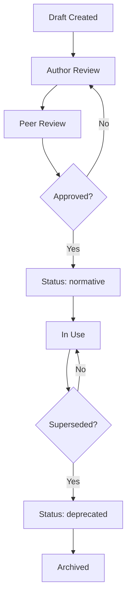

# DOCUMENTATION STANDARDS — VANTORIS

Status: normative. This document is the official documentation standard for the VANTORIS platform. All current and future documentation must conform to these standards. This document supersedes any implicit documentation conventions previously used and serves as the single source of truth for how VANTORIS documentation is created, maintained, versioned, and retired.

---

## 1. Purpose

Define the official documentation standards for the VANTORIS platform so that every document produced — whether by human contributors or AI agents — is accurate, consistent, auditable, and immediately useful as a reference. Documentation is not a secondary artifact; it is the primary source of truth from which implementation decisions, testing strategies, security policies, and AI reasoning are derived.

**Scope of applicability**: all documents under `docs/`, `README.md`, inline code comments that describe architectural decisions, API contracts under `docs/api/`, and any future documentation directories added to this repository.

---

## 2. Scope

These standards apply to:

- All Markdown documents in this repository.
- All OpenAPI / YAML contract files under `docs/api/`.
- All change history entries (commit messages, PR descriptions, release notes).
- All AI-generated documentation produced by automated agents operating on this repository.
- All documentation produced for the public website, Member Portal, Operations Center, VANTORIS iCommand, HeroBox, and NGO Portal.

---

## 3. Responsibilities

| Role | Responsibility |
|------|----------------|
| Document Author | Produce accurate, complete documentation that conforms to this standard before requesting review. |
| Code Reviewer / Approver | Verify that any PR containing documentation changes meets this standard before approval. |
| Platform Owners | Maintain and update this standard document in response to platform evolution. |
| AI Agents | Follow this standard exactly when generating, updating, or reviewing documentation. |
| Release Manager | Confirm that release notes meet Evidence and Change History requirements before tagging a release. |

---

## 4. Definitions

| Term | Definition |
|------|-----------|
| **Normative** | A rule or requirement that must be followed. Contrast with "informative", which provides context only. |
| **Single Source of Truth** | The canonical location for a given fact. No other document may contradict it. |
| **Evidence** | A verifiable artifact (CI link, staging URL, test run ID, screencast) that proves an implementation claim. |
| **Base44** | The development environment from which the VANTORIS production codebase is being imported. Base44 implementation is authoritative for current feature state until verified otherwise. |
| **Verification-First** | The principle that no feature may be declared complete without verifiable evidence in a running environment. |
| **Implementation-First** | The principle that production work must refactor the imported Base44 code rather than replace it wholesale. |
| **Deprecated** | A document or section marked as superseded. Deprecated content is archived, not deleted. |
| **AI Readable** | Content structured so that an AI assistant can unambiguously locate and reason about features, permissions, workflows, APIs, and components. |
| **Change History** | A structured log of every meaningful update to a document, recorded within the document itself. |
| **Deep Link** | A canonical URL or URI that navigates directly to a specific page, record, or workflow in the platform. |

---

## 5. General Principles

The following principles govern all documentation in this repository.

### 5.1 Accuracy

Documentation must reflect the current state of the platform. A document that describes a planned state must be clearly labeled with its status (see Section 9). No document may assert that a feature is implemented unless Evidence exists (see docs/REPOSITORY_STANDARDS.md and docs/CI_CD.md).

### 5.2 Documentation as Single Source of Truth

Documentation is not a summary of the code. It is the authoritative reference. When a document and the code differ, the discrepancy must be resolved — either by updating the document or by fixing the code — and tracked as a defect. AI agents must treat documents as authoritative for architectural intent even when code differs.

### 5.3 Versioning and Traceability

Every document must record its own version and change history. Document versions must align with platform release milestones where applicable (see Section 12). Every change must be traceable to a commit, a GitHub issue, and an author.

### 5.4 Auditability

Documentation changes are subject to the same review and audit requirements as code changes. PR descriptions for documentation-only changes must still include a summary, reason, and cross-references. Audit log entries for documentation changes are implicit in the Git history.

### 5.5 Consistency

Terminology, feature names, role names, and workflow names must be consistent across all documents. If a feature is called "Verification Center" in one document, it must be called "Verification Center" in every document — not "KYC", "identity verification", or any other synonym. See Section 10 for naming rules.

### 5.6 Human Readability

Documents must be written in clear, direct prose. Use short sentences. Avoid jargon without a definition. Use tables, lists, and diagrams where they improve clarity. Every document must be navigable from a table of contents.

### 5.7 AI Readability

Documents must be structured so that an AI assistant can answer the following questions without ambiguity: What does this feature do? Who is allowed to use it? Where does the user navigate to access it? What workflow does the user follow? What API endpoint does it use? What permissions are required? What events are audited? See Section 13 for AI readability requirements.

### 5.8 Maintainability

Documents must be easy to update. Avoid duplicating content across documents; instead, use cross-references. If a fact must change, it should need to change in only one place.

### 5.9 Base44 Synchronization

Documentation must remain synchronized with the imported Base44 implementation. When Base44 code is imported or refactored, the relevant documentation must be updated in the same PR or in a follow-up PR before the next release. See Section 14.

---

## 6. Document Structure

Every document in this repository must contain the following sections, in this order. Sections that do not apply to a specific document must still appear, with an explicit "Not applicable" or brief explanation.

### Required Sections

| Section | Content |
|---------|---------|
| **Title and Status** | Document title and normative status line at the top (e.g., `Status: normative.`). |
| **1. Purpose** | One to three sentences explaining why this document exists and what decision or requirement it governs. |
| **2. Scope** | What the document applies to; what it does not cover. |
| **3. Responsibilities** | A table listing roles and their obligations relative to this document. |
| **4. Definitions** | A glossary of terms used in the document. Always define terms on first use. |
| **5. Requirements / Rules** | The normative content of the document. Use "must", "must not", "should", and "may" consistently (see Section 6.1). |
| **6. Security Considerations** | Security requirements, risks, or constraints relevant to this document's subject matter. Even documents not primarily about security must note relevant considerations. |
| **7. Dependencies** | Other documents, systems, or services that this document depends on, and documents that depend on it. |
| **8. Cross References** | A list of related documents with file paths and a short description of the relationship. |
| **9. Change History** | A table of every meaningful update to this document (see Section 7). |

### Optional Sections

Documents may include additional sections such as Examples, Diagrams, Worked Scenarios, or Appendices after the required sections.

### 6.1 Normative Language

Use RFC 2119 modal verbs consistently:

| Word | Meaning |
|------|---------|
| **must** | Mandatory. Non-compliance is a defect. |
| **must not** | Prohibited. |
| **should** | Strongly recommended. Deviations require a documented reason. |
| **may** | Optional. |
| **will** | Declarative; describes how the system behaves rather than prescribing behavior. |

---

## 7. Change Management

Every meaningful update to a document must be recorded in the document's Change History section and in the associated commit message and PR description.

### 7.1 Change History Table

Every document must contain a Change History table at the end of the document with the following columns:

| Column | Content |
|--------|---------|
| **Date** | ISO 8601 date of the change (YYYY-MM-DD). |
| **Author** | GitHub username or full name of the person or agent making the change. |
| **Summary** | One-sentence description of what changed. |
| **Reason** | Why the change was made (e.g., new feature, platform decision, Base44 import). |
| **Related Issue** | GitHub issue number or URL, or "None". |
| **Related Commit** | Short commit SHA or "Pending" if not yet merged. |

### 7.2 What Requires a Change History Entry

The following changes require a Change History entry:

- Any addition, removal, or modification of a normative requirement.
- Renaming of a feature, role, or terminology term.
- Adding or removing a cross-reference.
- Updating a diagram.
- Correcting a factual error.

The following do not require a separate Change History entry but should be reflected in the commit message:

- Fixing a typo or grammatical error.
- Reformatting without changing content.

### 7.3 Commit Message Format for Documentation Changes

Commit messages for documentation-only changes must follow this format:

```
docs: <short description>

<optional body>

Related issue: #<number> or None
```

Example:

```
docs: add DOCUMENTATION_STANDARDS.md

Introduces the official documentation standard for VANTORIS.
All future documentation must conform to this standard.

Related issue: None
```

---

## 8. Document Lifecycle and Statuses

Every document must declare its status in a `Status:` line immediately after the title. Valid statuses are:

| Status | Meaning |
|--------|---------|
| `normative` | The document is authoritative and enforced. |
| `draft` | The document is in progress. It must not be cited as authoritative until promoted to `normative`. |
| `under-review` | The document is complete and awaiting approval. |
| `deprecated` | The document has been superseded. It must not be deleted; it must be archived and marked deprecated with a reference to its successor. |
| `archived` | The document is retained for historical reference only. No longer enforced. |

---

## 9. Naming Conventions

### 9.1 Feature Names

The following feature names are canonical and must be used consistently across all documents, code comments, UI labels, and API contracts. Do not use synonyms or abbreviations.

| Canonical Name | Must Not Be Called |
|----------------|--------------------|
| Verification Center | KYC, Identity Verification page, verification page |
| Member Portal | Member Center, Customer Portal, member app |
| Operations Center | Operations Dashboard, Admin Dashboard, ops panel |
| VANTORIS iCommand | Executive Dashboard, admin console, icommand, executive admin |
| Financial Assistant | AI chatbot, AI assistant, member AI, AI widget |
| Operations Assistant | Operator AI, AI tool, ops bot |
| Platform Intelligence | Executive AI, iCommand AI, admin AI |
| AI Command Center | ACC, AI popup, AI panel, floating AI |
| HeroBox | Community Vault, Group Savings, herobox |
| Member Advisor | Support bot, support AI, chat support AI |
| Trusted Devices | Trusted Device Manager, device management, device trust |
| Rules Engine | Workflow Engine, automation engine, rules system |

### 9.2 Role Names

| Canonical Role Name | Notes |
|---------------------|-------|
| Member | Any individual with a personal or business account. |
| Operator | A staff member with access to the Operations Center. |
| Platform Administrator | A staff member with access to VANTORIS iCommand. |
| AI Agent | An automated agent operating under the platform's AI layer. |

### 9.3 Document File Names

- Document file names must use SCREAMING_SNAKE_CASE: `DOCUMENT_NAME.md`.
- API contract files must use lowercase with hyphens: `resource-name.yaml`.
- Migration notes must use lowercase with hyphens: `migration-description.md`.

### 9.4 Avoid Duplicate Terminology

When multiple documents must reference the same concept, they must use the same canonical name and include a cross-reference to the authoritative document rather than re-defining the concept locally.

---

## 10. Diagrams

### 10.1 When to Use Diagrams

Diagrams are required when:

- Describing multi-step workflows or user journeys with branching paths.
- Showing relationships between system components or services.
- Illustrating data flows or event-driven interactions.
- Mapping navigation hierarchies.

Diagrams are optional but encouraged for:

- Explaining authentication flows.
- Summarizing permission matrices.
- Visualizing database entity relationships.

### 10.2 Preferred Format

Use Mermaid diagrams embedded in Markdown code blocks (` ```mermaid `). Mermaid is the preferred format because:

- It is version-controlled as plain text alongside the document.
- It renders natively in GitHub.
- It can be parsed and reasoned about by AI assistants.
- It does not require external tools to update.

External diagram files (e.g., PNG, SVG) may be included as supplementary material but must not be the sole representation of a diagram. A Mermaid equivalent or structured description must always accompany them.

### 10.3 Diagram Principles

- Keep diagrams simple. Prefer clarity over completeness.
- Every diagram must have a title and a one-sentence caption.
- Diagrams must be synchronized with the document text. If the diagram and the prose disagree, the document must be updated before merging.
- Diagrams must not contain proprietary credential information, internal system hostnames, or secrets.
- Diagrams must not duplicate content from another document's diagram. Use cross-references instead.

### 10.4 Mermaid Diagram Example

The following diagram illustrates the standard documentation lifecycle:



---

## 11. Versioning

### 11.1 Document Version Alignment

Documentation versions must align with platform releases. When a feature is introduced, modified, or removed in a platform release, the relevant documentation must be updated in the same release cycle. Documentation changes that lag behind implementation are treated as defects.

### 11.2 Version Metadata

Documents may optionally include a `Version:` line after the `Status:` line. When present, it must follow the format `Version: MAJOR.MINOR` aligned with the platform release version.

### 11.3 Deprecation

When a document is superseded:

1. Set its status to `deprecated`.
2. Add a notice at the top of the document: `> **Deprecated**: This document has been superseded by [SUCCESSOR_DOCUMENT.md](./SUCCESSOR_DOCUMENT.md) as of YYYY-MM-DD.`
3. Do not delete the file. Move it to `docs/archive/` if it would otherwise clutter the `docs/` directory.
4. Update all cross-references in other documents to point to the successor.

### 11.4 Archived Documents

Archived documents must remain accessible in the repository. They must not be edited after archival except to correct an error that would actively mislead readers. An archived document's Change History must record the archival date and reason.

---

## 12. Quality Requirements

Every document must answer the following six questions, either explicitly in its prose or implicitly through its structure:

| Question | Where It Must Be Answered |
|----------|--------------------------|
| **What?** | Purpose and Requirements sections. |
| **Why?** | Purpose section and the reason fields in Change History. |
| **Who?** | Responsibilities section and permission references. |
| **When?** | Workflow descriptions, lifecycle sections, and Change History dates. |
| **Where?** | Cross References section and navigation references (canonical routes, deep links). |
| **How?** | Requirements and workflow sections; diagrams. |

A document that cannot answer all six questions is incomplete and must not be promoted to `normative` status.

---

## 13. AI Readability Requirements

Because VANTORIS uses AI assistants (Financial Assistant for Members, Operations Assistant for Operators, Platform Intelligence for VANTORIS iCommand), documentation must be structured so that AI systems can reliably extract and reason about the following categories of information without ambiguity.

### 13.1 Feature Location

Every document that describes a feature must include:

- The canonical navigation path to that feature (e.g., "Member Portal → Accounts → Transfer").
- The deep-link URL pattern (e.g., `/accounts/{accountId}/transfer`).
- The workspace it belongs to (Member Portal, Operations Center, or VANTORIS iCommand).

### 13.2 Permissions

Every document that describes a feature accessible to users must include:

- The roles that may access the feature.
- The roles that must not access the feature.
- The permission descriptor key used in `libs/ai/permissions/` to gate the feature.

### 13.3 Workflows

Every workflow described in a document must include:

- A sequential list of steps or a Mermaid flowchart.
- The actor responsible for each step (Member, Operator, AI Agent, Rules Engine, System).
- The outcome of each branch (success, failure, escalation).
- The audit event emitted at each significant step.

### 13.4 APIs

Every document that describes an API or integration must include:

- The canonical OpenAPI file path (e.g., `docs/api/accounts.yaml`).
- The primary endpoint paths and HTTP methods.
- The authentication scope required.
- The audit event triggered.

### 13.5 Components

Every document that describes a UI component must include:

- The component name as it appears in `libs/design-system/`.
- The props or configuration accepted.
- The workspaces where the component is used.

### 13.6 Unambiguous Language

Documents must avoid:

- Pronouns without clear antecedents ("it", "they", "this" without a noun).
- Abbreviations that are not defined in the Definitions section.
- Passive voice in requirement statements (prefer "The system must log…" over "Events must be logged…").
- Synonym drift (using different words for the same concept across sections).

---

## 14. Base44 Synchronization

### 14.1 Documentation Must Follow Implementation

Documentation must remain synchronized with the imported Base44 implementation. When Base44 code is imported:

1. The importing PR must identify which documents are affected.
2. Affected documents must be updated in the same PR or in a follow-up PR merged before the next release.
3. If documentation cannot be updated immediately, an issue must be created and linked in the importing PR.

### 14.2 Implementation Changes Require Documentation Updates

Any PR that changes the behavior of a feature, API, permission, or workflow must include an update to the relevant documentation. PRs that change behavior without updating documentation must not be merged to `main`.

### 14.3 Feature Status Tracking

All features imported from Base44 must be classified in their relevant documentation using one of the following statuses (consistent with docs/REPOSITORY_STANDARDS.md):

| Status | Meaning |
|--------|---------|
| **Verified** | Feature is implemented and Evidence exists from a running environment. |
| **Created but not integrated** | Code exists but is not connected or lacks integration Evidence. |
| **Not implemented** | Listed in documentation but no code exists. |
| **Deprecated** | Feature has been removed or superseded. Documentation is archived. |

### 14.4 No Replacement Without Verification

Documentation must not describe a replacement implementation unless that replacement has been verified in staging or production. Documentation describing planned replacements must use the `draft` status and include a note that the feature is planned, not implemented.

---

## 15. Existing Document Index and Authoritative Sources

The following table lists all current authoritative documents in this repository, their status, and their primary subject. All future documentation must cross-reference this index rather than duplicating its content.

| Document | Status | Subject |
|----------|--------|---------|
| `README.md` | normative | Repository overview, module list, getting started |
| `docs/ARCHITECTURE.md` | normative | System architecture, five architectural domains, technology decisions |
| `docs/REPOSITORY_STRUCTURE.md` | normative | Canonical monorepo layout, Base44 import placement |
| `docs/REPOSITORY_STANDARDS.md` | normative | Engineering standards, Implementation-First, Verification-First, AI Command Center, chat, personalization |
| `docs/CODING_STANDARDS.md` | normative | TypeScript rules, linting, testing requirements, design system usage, permission gating |
| `docs/CI_CD.md` | normative | CI/CD pipeline design, gating requirements, evidence artifacts |
| `docs/API_ARCHITECTURE.md` | normative | Contract-first API design, OpenAPI standards, banking and AI APIs |
| `docs/DATABASE_ARCHITECTURE.md` | normative | PostgreSQL schema domains, ledger design, data ownership, migration compatibility |
| `docs/COMPONENT_ARCHITECTURE.md` | normative | UI component hierarchy, design system, accessibility |
| `docs/DESIGN_SYSTEM.md` | normative | Visual design language, color palette, typography, component standards, responsive design |
| `docs/NAVIGATION_ARCHITECTURE.md` | normative | Complete navigation structure, deep links, button behavior, responsive navigation |
| `docs/USER_JOURNEYS.md` | normative | End-to-end workflows for all major platform journeys |
| `docs/TESTING.md` | normative | Testing strategy, test types, release criteria |
| `docs/SECURITY_STANDARDS.md` | normative | Security policies, encryption, PII retention, secrets management |
| `docs/AUTHENTICATION.md` | normative | Authentication flows, MFA, passkeys, trusted devices, session management |
| `docs/RBAC.md` | normative | Role definitions, permission matrix, access control model |
| `docs/MIGRATION_GUIDE.md` | normative | Base44 import checklist, table mapping, post-import CI steps |
| `docs/DOCUMENTATION_STANDARDS.md` | normative | This document. Official documentation standards for VANTORIS. |

> **Note**: Documents listed above that do not yet exist in the repository are planned and must be created before their subject matter is implemented. Their absence does not waive the requirement that implementation must be accompanied by documentation.

---

## 16. Security Considerations

- Documentation must not contain secrets, credentials, API keys, internal hostnames, or production system identifiers.
- Documents describing security-sensitive features (authentication, RBAC, encryption, trusted devices) must be reviewed by a security-designated reviewer before being promoted to `normative`.
- Documentation for features that have not yet been security-reviewed must carry a note: `> **Security review pending.**`
- Diagrams must not expose internal network topology, IP ranges, or system configurations that would assist an attacker.
- Role and permission descriptions in documentation must not reveal more about the internal authorization model than is necessary for contributors to implement and test the feature.

---

## 17. Dependencies

### Documents That Depend on This Document

All documents in this repository depend on this document for structure, naming, and change management requirements.

### This Document Depends On

| Document | Dependency |
|----------|-----------|
| `docs/REPOSITORY_STANDARDS.md` | Verification-First and Implementation-First policies referenced in Sections 5 and 14. |
| `docs/CI_CD.md` | Evidence requirements referenced in Section 14. |
| `docs/CODING_STANDARDS.md` | Design system, accessibility, and permission gating requirements referenced in Sections 6 and 13. |
| `docs/ARCHITECTURE.md` | Five architectural domains referenced in Section 15. |

---

## 18. Cross References

| Document | Relationship |
|----------|-------------|
| `docs/REPOSITORY_STANDARDS.md` | Source of Verification-First and Implementation-First policies; Evidence field definitions. |
| `docs/CODING_STANDARDS.md` | Coding counterpart to these documentation standards; shared AI Command Center and chat requirements. |
| `docs/CI_CD.md` | CI enforcement of Evidence requirements referenced in Section 14. |
| `docs/ARCHITECTURE.md` | Architectural context for all feature documentation. |
| `docs/API_ARCHITECTURE.md` | API contract standards referenced in Section 13.4. |
| `docs/NAVIGATION_ARCHITECTURE.md` | Navigation path requirements referenced in Section 13.1. |
| `docs/USER_JOURNEYS.md` | Workflow documentation requirements referenced in Section 13.3. |
| `docs/DESIGN_SYSTEM.md` | Component and UI documentation requirements referenced in Section 13.5. |

---

## 19. Change History

| Date | Author | Summary | Reason | Related Issue | Related Commit |
|------|--------|---------|--------|---------------|----------------|
| 2026-07-15 | iamtheoracle | Created DOCUMENTATION_STANDARDS.md | Establish official documentation standard for VANTORIS incorporating all prior architectural decisions | None | Pending |
